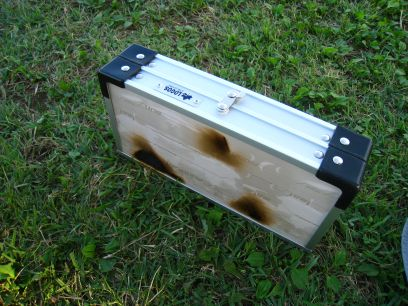
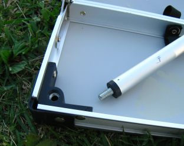
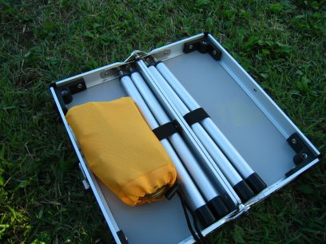
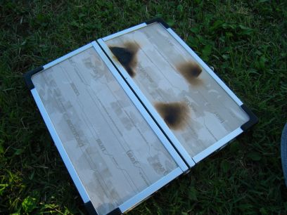

- 2009年08月11日

ちゃぶ台
================================================================================
ロゴスが出している、ちゃぶ台というか単なるテーブルなんですけど、思ったよりもgoodで重宝します。

30cm x 30cm しか面積が無いのであんまりモノが置けません。
テーブルの一辺が30cmなんですけど、このテーブル足も同様に30cmもあって同サイズのコンパクトテーブルに比べて背が高いです。キャプテンスタッグのロールテーブルも重宝しましたが、地べたに板を置いているのとほぼ変わらないような低さで便利でしたが快適ではありませんでした。

CHABU-DAIは高さがあるので低い椅子に座ったときとのバランスがぴったりです。

悪い点なんですが・・・このちゃぶ台大きさの割りにかなり重たい。足以外の本体がかなり重厚なつくりになっていて、足の強度との比較ではかなりオーバースペック気味。とくにヒンジ部分はファミキャン用のテーブルにしても大丈夫かと思うぐらいのがっしりしたものになっている。

このヒンジ部が壊れるほどのものを置くときはそれよりも先に絶対に足が折れる。

ヒンジ自体は本体にリベット止めされているので、そのうち除去して蝶ネジか何かで結合できるように改造したい。

秀逸な折りたたみ機構
================================================================================
本体は単に二つ折り。

足に至ってはばらばらの足をネジでねじ込むという完全に思考が停止しているシンプルさ。

折った本体には足以外にも空間があるので、本体自体が別のパッキングのハードケースとして機能します。私はお箸とかアルコールバーナーとか鋏とか栓抜きとかの調理道具を一緒に収納しています。

天板の耐久性
================================================================================
天板自体は木材をなんかでコーティングしたものらしく、ちょっと高熱のものを置くと表面が溶けたりします。

ステンレスの板を敷いて遮熱してみました。

