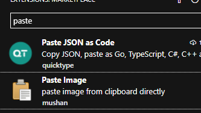

専用機にするのでポータブル版をベースに環境構築していく。

#hogeaa

## hoge

起動して Markdown All in One の拡張をインストールする。

File → Save Workspace As... で workspace の設定ファイルを保存する。

今回は複数管理したい Obsidian の vault を格納しているフォルダに設置した。

この状態で Open Folder で Obsidian で作っていた Vault のフォルダを開く

この時点でこんな感じで最悪である。


autosave を ON にする。

Obsidian 側で入れた変更が即反映されることがわかる。
VSCode 側で入れた変更も Obsidina 側に反映されて結構いい感じである。

フォントがクソなので、フォントを直す。

これを Workspace 専用の設定にする。通常通り設定画面を開くが workspace タブがあると思うのでそれを使う


Font Family を  `HackGen35Nerd` にする。
Font Size を 18 に設定する。


ちょっとはまともになった。

日本語が意味不明に黄色でハイライトされるのでこいつを解除する。

```
Unicode Highlight: Include Comments
```

という設定を `false` に設定すればよいようだ。

これは全体設定に入れるので user に設定する。

```
Unicode Highlight: Non Basic ASCII
```

も `false` にする。


ややマシになった。

見た目が全体てきに気に食わないのでテーマを変更する。

Cyberpunk 2077 rebuild というテーマを入れる。


こんな感じになったが、アクティブなタブの文字がスゴイ読みにくい。

すげー緑なんだけど。

やっぱりタブが読みづらい

Dark Pixel というテーマがよさげだったのでこれでよいかな。


よくない。ウィンドウメニューが半透明でスーパー読みズラ。

Neon Genesis Theme というやつを入れる。

やっぱりだめ。最終的に Oldschool Theme におちつく。

次に画像をプレビュー表示したいのだがなんだが VSCode はなんでもエディタ部分に挿入できるわけでないっぽく
そのような拡張が存在しないっぽい。

なのでとりあえずリアルタイムのプレビューをやる方法を見る

コマンドパレットから preview で検索してでてくるやつでOK

Obsidian から貼った画像もしっかりプレビューできている。OK

次にクリップボード画像をコピペ可能にする。

Paste Image というそのまんまの拡張があるのでそれで入れる。




画像をコピーしたら `ctrl + alt + v` ではっつける


このへんでエディタ部分のスタイルがどうにもうまくいかなかったり、自分好みにするのが遠すぎると判断して終了。

