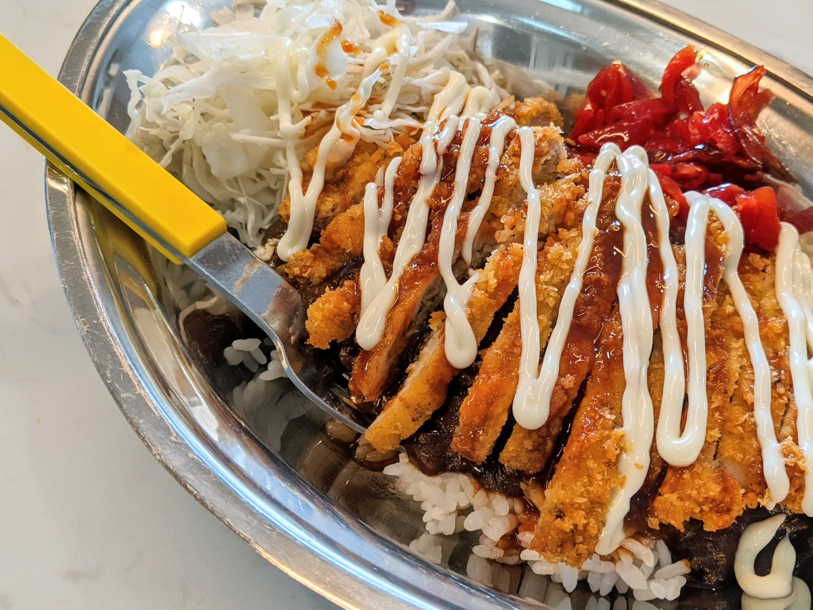

2021-12-23 ゴーゴーカレーレトルト
================================================================================
チャンカレ純正食器でエルマヨ風

2009年03月15日 ハウスバーモントカレー中辛
================================================================================
作った。

ネギ、たまねぎ、鶏胸肉、ジャガイモ、ニンジンを煮てぶち込んだだけ。

味。食った後に舌に油のベトベト感あり

材料費 1300円

現在2食食った。あと7食ぐらいはいけそう
パッケージ表記には12食作れると書いてある・・・・12食換算で1食120kcal、意外に低い、米が500kcalと考えても620kcal

